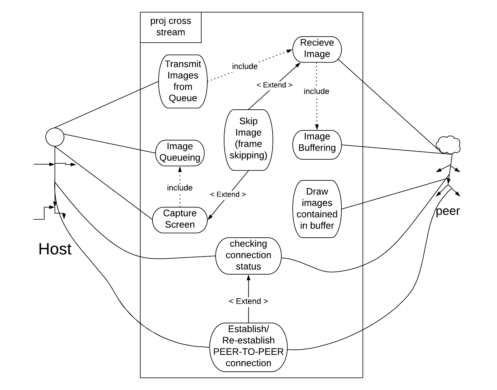
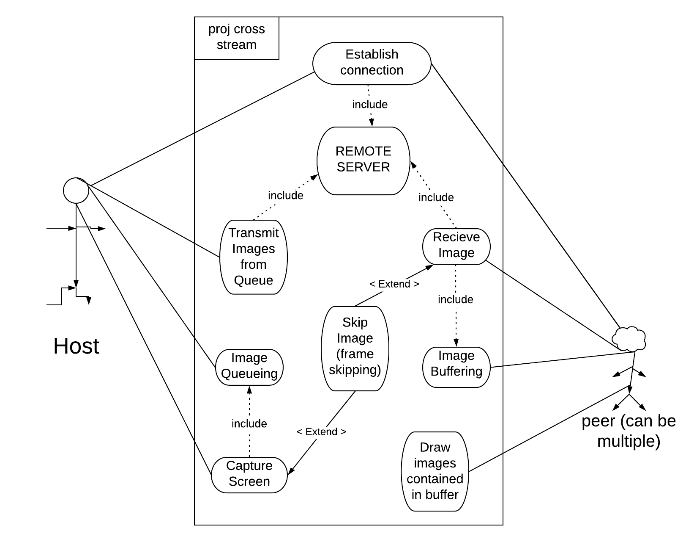

# Cross-Stream project

## Project Abstract
This project will allow users to stream videos or surf the web with each other.
There will be one HOST that streams image data to a server or directly to peer.
The peers will pull those image data, buffers them, and display them on their screens.

**The first model is the PEER-TO-PEER model:**

The downside to the P2P model is that it will probably require users to port forward or use a vpn.

**The second model is the REMOTE model:**

The downside to the REMOTE model is that remote servers are expensive and a reliable custom remote server is difficult to set up.

## Project Relevance
This project can be very simple or very complicated. There are room for working with remote servers (like AWS), front end & back end, multi-threading, and networking. 
Not only is it flexible, but it is also useful. As shown from the lifetime of rabb.it, people loved the idea of streaming videos with their friends online.
The video streaming site https://www.rabb.it/ recently went down and that is what inspired me to propose this project.

Since the project will start from scratch, most, if not all, of these goals will be met:
**Project Management:** The project could get too large in scale so project management will involve idealizing the deadline of each features, and which features are realistic and what to be changed.
**Version Control:** There will be different versions like P2P or Remote implementation. Also different versions will be pushed constantly if we follow AGILE.
**Build:** Builds will be of baselines.
**Test:** This project will involve many individual components that could be tested using Unit testing.
**Issue Tracking:** GitHub will be used.

## Conceptual Design
The general idea is that a client (assumed simple HTTP client) will act as a host. 

In a Peer-to-Peer implementation, the host will listen for connections from other clients. Once a connection is established, the host will begin streaming image data to the peers.

In a Remote implementation, the host will also listen for connections but a bit differently. When hosts connect, they will send metadata to a Remote server. Clients who wants to connect to a host will check the remote server to see if the host exist to establish connection. Hosts will then post images to the remote server and clients will pull from them.

Personally, I do not have experience in communications through remote servers but I do have experience in dealing with web clients and peer to peer connections.

## Background
The project will not necessarily based on rabb.it but this is the github page:
- https://github.com/Rabbit-Inc

**The github could be useful for any references.**

## Required Resources
- C# and winform or any language with easy-to-implement UI interface
- Web UI
- Node JS technology if web backend is implement
- Backend can also just be simple HTTP servers
- Remote or cloud services like AWS
- No MAC OS

